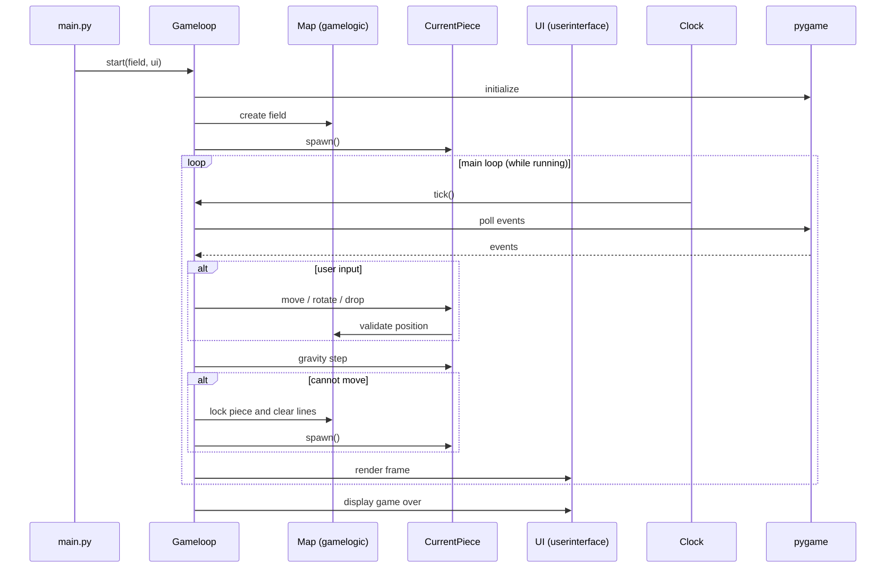

### Tetris sequence diagram (simplified)

```mermaid
sequenceDiagram
    participant Main as main.py
    participant Game as Gameloop
    participant Map as Map (gamelogic)
    participant Piece as CurrentPiece
    participant UI as UI (userinterface)
    participant Clock as Clock
    participant Pygame as pygame

    Main->>Game: start(field, ui)
    Game->>Pygame: initialize
    Game->>Map: create field
    Game->>Piece: spawn()

    loop main loop (while running)
        Clock->>Game: tick()
        Game->>Pygame: poll events
        Pygame-->>Game: events

        alt user input
            Game->>Piece: move / rotate / drop
            Piece->>Map: validate position
        end

        Game->>Piece: gravity step
        alt cannot move
            Game->>Map: lock piece and clear lines
            Game->>Piece: spawn()
        end

        Game->>UI: render frame
    end

    Game->>UI: display game over
```
