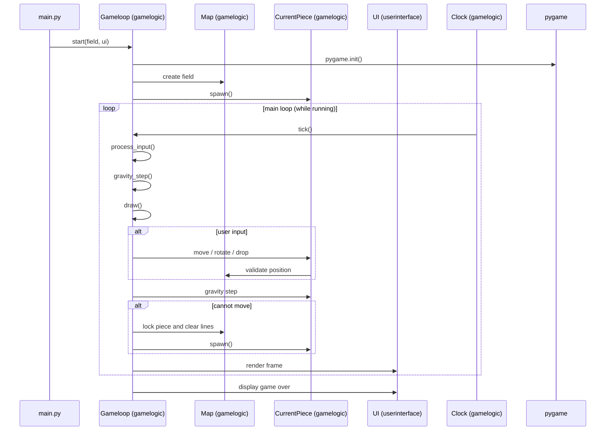

## Arkkitehtuurikuvaus

### Rakenne

Koodi on jaettu kolmeen tiedostoon:
-  main.py, mikä suorittaa sovelluksen käynnistämisen ja ei sisällä logiikkaa, vaan määrittelee tärkeitä muuttujia ja kutsuu sovelluslogiikan ja käyttöliittymän.
- gamelogic.py, mikä sisältää pelin logiikan, kuten pelisilmukan, pelialueen ja palikoiden käsittelyn.
- userinterface.py hoitaa kentän ja palikoiden piirtämisen.

### Sekvenssikaavio

