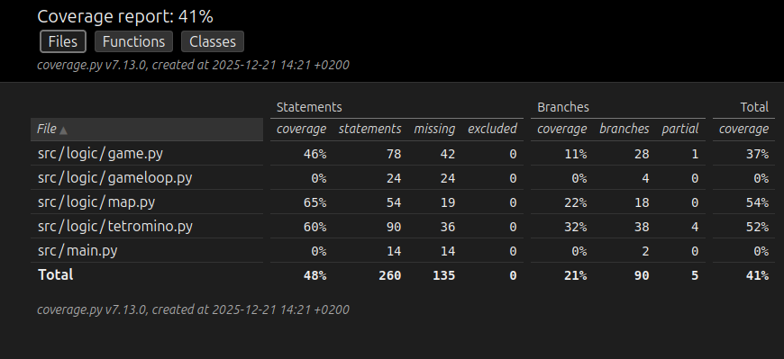

## Testausdokumentti
Ohjelmaa on testattu yksikkötesteillä käyttäen unittest-moduulia.

### Sovelluslogiikka
Sovelluslogiikasta on testattu kartta ja tetrominojen lisääminen karttaan. Myös niiden pyörittäminen on testattu. Game.py tiedostosta on testattu tetrominojen putoamiseen liittyvät funktiot ja pisteidenlasku.

### Testikatavuus
Käyttöliittymä poislukien testikattavuus on 41%

### Asennus ja konfiguraatio
Sovellus on testattu toimivaksi Ubuntu 24 ja Cubbli 24 käyttöjärjestelmillä.

