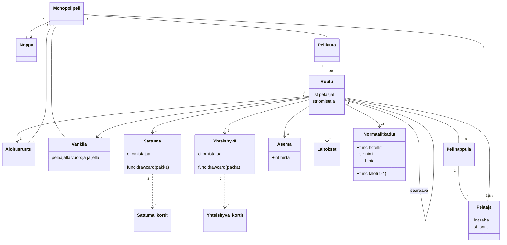

## Monopoli, alustava luokkakaavio

```mermaid

 classDiagram
    Monopolipeli "1" -- "2" Noppa
    Monopolipeli "1" -- "1" Pelilauta
    Pelilauta "1" -- "40" Ruutu
    Ruutu "1" --> "1" Aloitusruutu
    Monopolipeli "1" -- "1" Aloitusruutu
    Monopolipeli "1" -- "1" Vankila
    Ruutu "1" --> "1" Vankila
    Ruutu "1" -->  "3"Sattuma
    Sattuma "3" ..> "*" Sattuma_kortit
    Yhteishyvä "2" ..> "*" Yhteishyvä_kortit
    Ruutu "1" --> "2" Yhteishyvä
    Ruutu --> "4" Asema
    Ruutu --> "2" Laitokset
    Ruutu --> "18" Normaalitkadut
    Ruutu "1" -- "1" Ruutu : seuraava
    Ruutu "1" -- "0..8" Pelinappula
    Pelinappula "1" -- "1" Pelaaja
    Pelaaja "2..8" -- "1" Monopolipeli
    Pelaaja "*" -- Ruutu

    class Pelaaja{
        +int raha
        list tontit
    }

    class Normaalitkadut{
        +func talot (1-4)
        +func hotellit
        +str  nimi
        +int hinta
    }

    class Vankila{
        pelaajalla vuoroja jäljellä
    }

    class Asema{
        +int hinta
    }

    class Ruutu{
        list pelaajat
        str  omistaja
    }
    class Sattuma{
        func drawcard(pakka)
        ei omistajaa
    }
    class Yhteishyvä{
        func drawcard(pakka)
        ei omistajaa
    }
```
