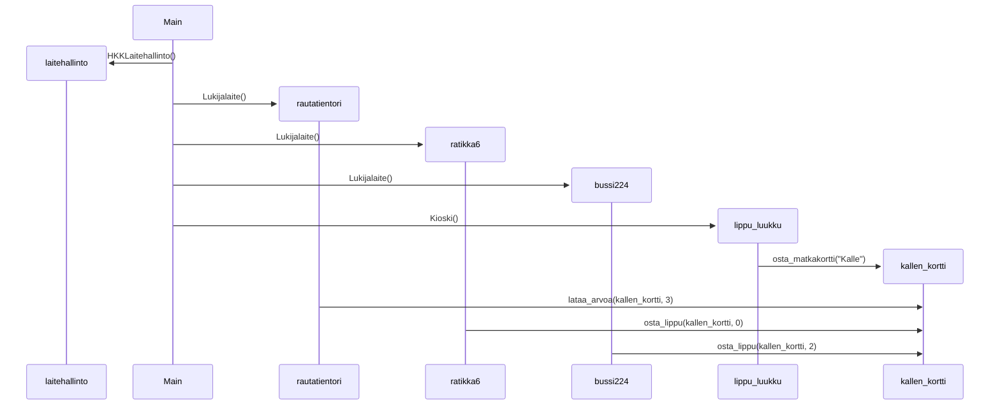

```mermaid

sequenceDiagram
    create participant laitehallinto
    Main ->> laitehallinto: HKKLaitehallinto()
    create participant rautatientori
    Main ->> rautatientori: Lukijalaite()
    create participant ratikka6
    Main ->> ratikka6: Lukijalaite()
    create participant bussi224
    Main ->> bussi224: Lukijalaite()
    create participant lippu_luukku
    Main ->> lippu_luukku: Kioski()
    create participant kallen_kortti
    lippu_luukku ->> kallen_kortti: osta_matkakortti("Kalle") 
    rautatientori ->> kallen_kortti: lataa_arvoa(kallen_kortti, 3)
    ratikka6 ->> kallen_kortti: osta_lippu(kallen_kortti, 0)
    bussi224 ->> kallen_kortti: osta_lippu(kallen_kortti, 2)

    

```